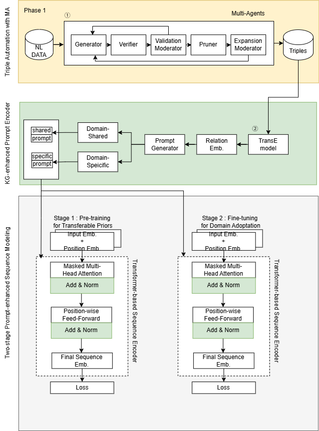
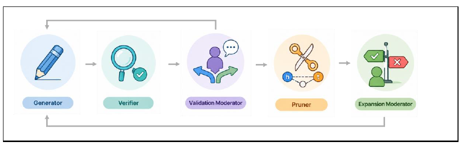
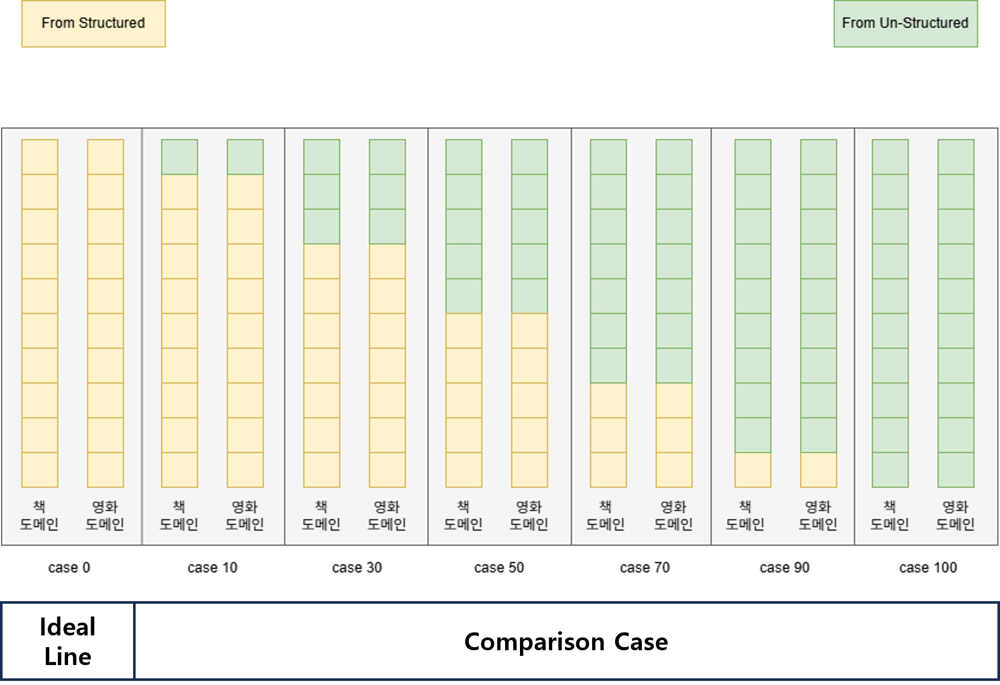
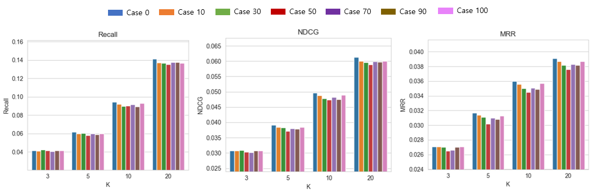
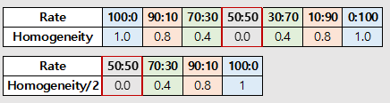
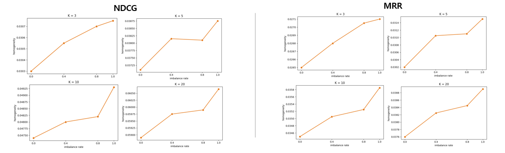

# Automated Knowledge Graph Generation for Cross-Domain Recommendation Using Multi-Agent Systems

------------------------------------------------------------------------------------------------
## Overview
이 프로젝트는 멀티 에이전트 기반 LLM 협업을 활용해 교차 도메인 추천을 위한 지식 그래프(Kknowledge Graph, KG)를 자동 구축하는 방법론을 제안합니다. 생성된 KG는 source domain의 구조적 의미를 보존한 채 embedding space로 전이되며, target domain 추천 모델의 성능 향상에 활용됩니다.

## Motivation
기존 CDR 방법은 사용자/아이템 상호작용 전이에 집중하는 경우가 많아, 콜드 스타트 환경 시 적합한 추천에 어려움을 겪습니다. 이에 구조화된 형식과 풍부한 의미를 갖는 KG를 활용하고 관계 기반 임베딩 방법이 대안으로 활용되지만, 구조화된 DB 와 전문화된 언어 쿼리 사용 및 연구자/전문가의 수동 개입이 필수적으로 고려되어 교차 도메인 추천용 KG 구축에 어려움을 겪습니다. 이에 멀티 에이전트를 활용하여 고차원적인 작업인 교차 도메인 추천 시스템용 KG 구축 자동화를 제안합니다.

## Proposed Method
제안 방법론은 두 단계로 구성됩니다.
1. Multi-agent based KG construction
2. KG embedding transfer for target recommendation

## Architecture

* 연두 & 회색 박스는 KGBridge 프레임워크 사용

## Multi-Agent KG Construction
- Generator: RDF triple 후보 생성
- Verifier: triple의 구조 및 의미 검증
- Validation Moderator: 검증 결과 조정
- Pruner: 저품질/중복 triple 제거
- Expansion Moderator: 그래프 확장 여부 결정

## Embedding Transfer
구축된 source KG는 TransE로 임베딩되며, 이후 KGBridge를 통해 target sequential recommendation에 반영됩니다.

## Experimental Setting

- Dataset: Amazon Books, Movie/TV
- Source KG construction: Amazon metadata + LLM-based multi-agent pipeline
- Embedding model: TransE
- Downstream recommender: KGBridge
- Metrics: Recall, NDCG, MRR

실험에서는 위 설정하에서 정형(구조화된 DB 기반) 트리플과 비정형(비정형 데이터 기반) 트리플의 구성 비율을 여러 수준으로 바꾸어, 각 구성에 대해 동일한 추천 모델의 성능을 비교하였습니다.

정형 트리플과 비정형 트리플의 차이점은 아래과 같으며, 정형 트리플을 AmazonKG 논문의 트리플 데이터를 사용하였습니다.

- 정형 트리플 : 구조화된 DB (e.g. DBPedia) 로부터 SPARQL3 쿼리로 추출하여 구성
- 비정형 트리플 : 오픈 소스 기반 비정형 데이터로부터 멀티 에이전트를 사용하여 추출하여 구성

## Key Findings
실험 결과, 한 가지 방식의 트리플 비율이 우세한 경우에는 성능이 상대적으로 높고 두 방식이 유사한 비율(특히 50:50)로 혼합된 경우 성능이 가장 낮게 나타나는 양상을 확인하였다.
결과를 동질성에 따른 비율을 기준으로 성능 평가 그래프로 변환하면 동질성 비율이 높을수록 추천 결과 성능이 우상향함을 보여줍니다.
이는 트리플 생성 방식의 품질 차이보다 서로 다른 지식 그래프 간의 구조적 이질성과 정렬 불일치가 추천 성능에 더 큰 영향을 미칠 수 있음을 시사합니다.

## Contributions
- Multi-agent 기반 KG 자동 구축 프레임워크 제안
- Cross-domain recommendation을 위한 KG embedding transfer 설계
- 구조적 이질성과 의미 정합성 문제를 실험적으로 분석

## 참고 git
- 추천 도메인용 구조화된 방식으로 생성한 KG : https://github.com/WangYuhan-0520/Amazon-KG-v2.0-dataset.git
- TransE 학습 및 생성 : https://github.com/thunlp/OpenKE.git
- KG 기반 교차 도메인 추천 프레임워크 : https://github.com/WangYuhan-0520/KGBridge.git

